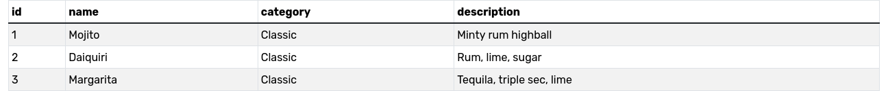
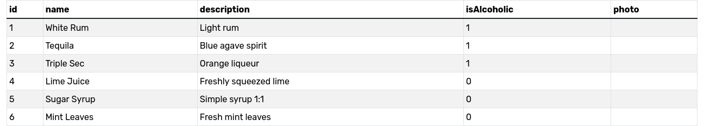

# Cocktail Bar API

NestJS + TypeORM (SQLite). Zarządzanie koktajlami, składnikami oraz ilościami składników.

## Szybki start

- Wymagania: Node 18+, npm lub pnpm, sqlite3 (CLI opcjonalnie)
- Instalacja:
  - npm i
- Uruchomienie:
  - npm run start:dev

Baza danych: plik `db.sqlite` w katalogu projektu.

## Schemat danych

- Tabela `cocktail` (id, name, category, description)
- Tabela `ingredient` (id, name, description, isAlcoholic, photo?)
- Relacja : `cocktail_ingredients`
  - Kolumny: `cocktailId`, `ingredientId`, `quantity` (TEXT)
  - Nazwy tabeli i kolumn są przypięte w `@JoinTable` w encji `Cocktail`.

- 
- 

## Endpointy

- POST /ingredient
- GET /ingredient
- GET /ingredient/:id
- PATCH /ingredient/:id
- PUT /ingredeint/:id
- DELETE /cocktail/:id

- POST /cocktail
- GET /cocktail
- PUT /cocktail/:id
- GET /cocktail/:id
- PATCH /cocktail/:id
- DELETE /cocktail/:id

## Filtrowanie, sortowanie, paginacja (GET /cocktail)

Obsługiwane parametry zapytania (patrz `FilterSortCocktailsDto` i `findAllFiltered`):

- name: string (LIKE %name%)
- category: string (dokładne dopasowanie)
- ingredientId: number (koktajle zawierające dany składnik)
- ingredientIds: lista liczb, np. `1,4,5`
- ingredientsMode: `any` | `all` (dla `ingredientIds`)
- alcoholFree: 'true' | 'false' (true = bezalkoholowe)
- sort: np. `name`, `-name`, `category,name`, `id`, `-id`
- page: number (>=1)
- limit: number (1..100)

## Przykłady cURL

export BASE=http://localhost:3000

# Dodawanie składników

curl -sS -H 'Content-Type: application/json' -X POST "$BASE/ingredient" -d '{"name":"Dark Rum","description":"Rich molasses rum","isAlcoholic":true}'
curl -sS -H 'Content-Type: application/json' -X POST "$BASE/ingredient" -d '{"name":"Ginger Beer","description":"Spicy ginger soda","isAlcoholic":false}'

DRUM=$(curl -sS "$BASE/ingredient" | jq -r '.[]|select(.name=="Dark Rum")|.id' | head -n1)
GBEER=$(curl -sS "$BASE/ingredient" | jq -r '.[]|select(.name=="Ginger Beer")|.id' | head -n1)

# Dodawanie koktaili

curl -sS -H 'Content-Type: application/json' -X POST "$BASE/cocktail" -d @- <<EOF
{
  "name":"Dark 'n' Stormy",
  "category":"Classic",
  "description":"Dark rum highball with ginger beer",
  "ingredientPairs":[[$DRUM,"50 ml"],[$GBEER,"120 ml"]]
}
EOF

# Patch i Put

CID=$(curl -sS "$BASE/cocktail" | jq -r '.[]|select(.name=="Dark '\''n'\'' Stormy")|.id' | head -n1)

curl -sS -H 'Content-Type: application/json' -X PATCH "$BASE/cocktail/$CID" -d @- <<EOF
{
  "ingredientPairs":[[$DRUM,"55 ml"],[$GBEER,"110 ml"]]
}
EOF

curl -sS -H 'Content-Type: application/json' -X PUT "$BASE/cocktail/$CID" -d @- <<EOF
{
  "name":"Dark 'n' Stormy",
  "category":"Classic",
  "description":"Balanced and spicy",
  "ingredientPairs":[[$DRUM,"50 ml"],[$GBEER,"120 ml"]]
}
EOF